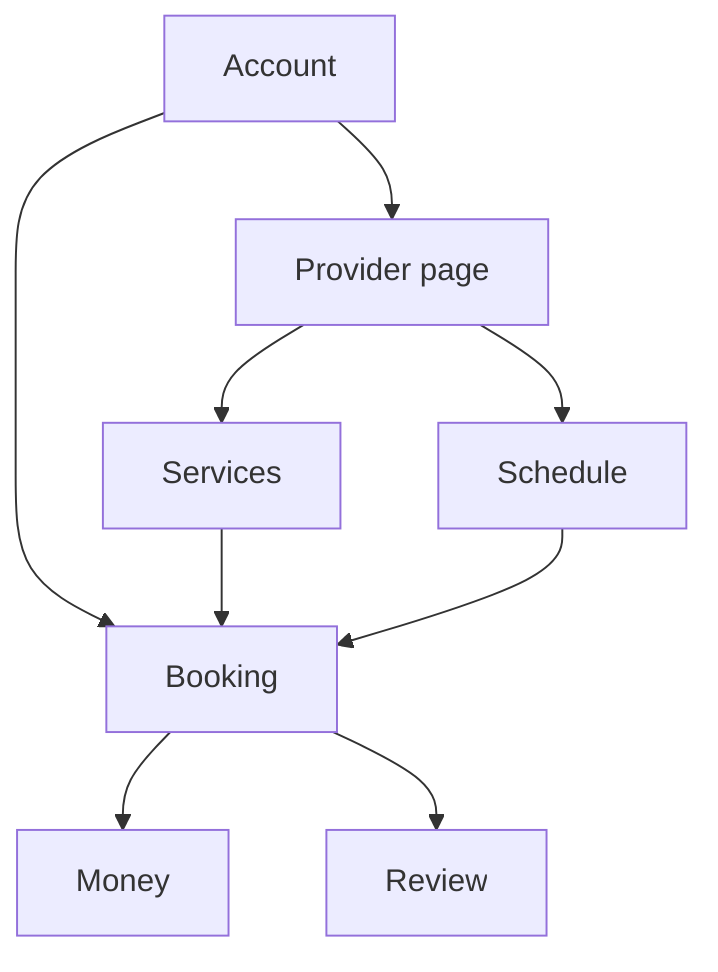
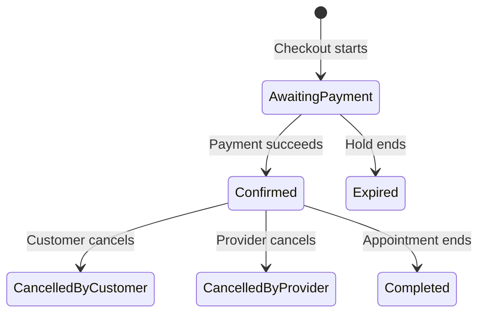

# Ceaute Domain Model

**Status:** Ready for review  
**Version:** 0.2  
**Last updated:** 29 August 2026  
**Based on:** MVP specification v0.2 and architecture decisions v0.2

## What this document explains

The MVP specification tells us how Ceaute behaves. The architecture decisions tell us how we intend to build it.

This document sits between them and the database schema. It identifies the important things Ceaute must remember, what each one means and how they connect.

It deliberately does not decide SQL table names, column types or indexes. Those come in the schema document.

If you remember nothing else, remember this:

> A person uses one account. That account may publish one provider page. The provider page owns its services, active location and availability. A customer combines those things into a booking. The booking then owns the payment history, refund history and possible review.



The model therefore has four main areas:

1. People and provider pages.
2. Services and availability.
3. Bookings.
4. Payments, refunds and reviews.

---

## 1. People and provider pages

### Account

An **account** is a person who can sign in to Ceaute.

It holds the identity and contact information Ceaute needs across the product:

- Supabase authentication identity.
- Email address and verification state.
- Full name.
- Phone number and verification state.

An account can book many providers as a customer. The same account may also create one provider page.

We do not create separate customer and provider account types. A person's role depends on what they are doing.

### Provider page

A **provider page** is the independent beauty business attached to an account.

It holds the public identity of the business:

- Display name.
- Unique username.
- Short biography.
- Primary beauty category.
- Draft or published state.
- Page-wide booking settings.

One account owns either no provider page or one provider page. Teams and several provider pages per account are outside the MVP.

A provider page is not just a profile. It is the parent of the provider's location, portfolio, service catalogue, schedule, policies, payment account and received bookings.

### Primary beauty category

A **primary beauty category** broadly describes the provider, such as Nails, Lashes or Hair.

Ceaute controls this list. It helps customers understand the page and gives Ceaute a broad way to group providers. It does not replace the more precise categories attached to individual treatments.

### Active location

A **provider location** represents somewhere the provider has worked.

A provider page may keep several historical locations, but only one is active for search and new bookings.

The active location contains:

- The public area shown before booking.
- The private exact address.
- Access instructions.
- Whether it is the provider's current location.

When the provider changes location, the previous record remains for history. Existing bookings keep their own location copy and are not rewritten.

### Portfolio image

A **portfolio image** is work displayed on the provider's public page.

It belongs to one provider page and keeps its display position and visibility. The MVP supports images only.

### Payment account

A **provider payment account** links the provider page to its Stripe connected account.

It tells Ceaute whether Stripe onboarding is complete and whether the provider can receive payments. It does not replace Ceaute's own booking and payment records.

### Policy version

A **policy version** is one frozen version of the provider's booking rules.

It contains the structured financial rules Ceaute enforces and the practical instructions the provider writes. When a provider changes a rule, Ceaute creates a new version instead of editing the old version in place.

One version is current for new bookings. Existing bookings retain the version and policy snapshot they accepted.

---

## 2. Services and availability

The provider's services answer two different questions:

- What can the customer buy?
- When does it fit into the provider's working day?

### Discovery category

A **discovery category** is Ceaute's standard name for a type of treatment, such as Acrylic nails or Lash extensions.

Ceaute controls these categories because marketplace search needs consistent language across providers.

### Treatment group

A **treatment group** is a section created by the provider to organise their own page, such as Full sets, French tips or Infills.

It has no marketplace-wide meaning. Two providers may arrange the same services differently.

### Treatment

A **treatment** is the main service a customer books.

It belongs to one provider page, one provider-created treatment group and one Ceaute discovery category. It contains the provider's name, description, price, duration, display position and active state.

Treatments are archived rather than removed once they have been used by a booking. Archiving stops new purchases without damaging history.

### Add-on

An **add-on** is an optional extra that changes the price, duration or both.

It belongs to one provider page. A separate eligibility relationship records which treatments allow it because the same add-on may work with several treatments.

Customers choose add-ons before choosing a time. The combined duration determines which appointments fit.

### Weekly availability

A **weekly availability rule** describes one normal working period for one weekday.

For example:

```text
Tuesday: 10:00–18:00
```

A provider has at most one rule per weekday in the MVP. Split shifts are not represented.

The provider page also stores its rolling booking window of 30, 60 or 90 days. Ceaute applies the platform-wide 24-hour minimum notice when calculating availability.

### Blocked date

A **blocked date** removes one whole calendar date from the normal weekly schedule.

It covers holidays, sickness and personal commitments. Partial-day changes and extra one-off hours are outside the MVP.

### There is no slot entity

Ceaute does not store every empty appointment time.

Available times are calculated from:

- Weekly availability.
- Blocked dates.
- Booking window and minimum notice.
- Treatment and add-on duration.
- Existing bookings awaiting payment or confirmed.

The result is a temporary view of what can be booked, not permanent business data.

---

## 3. The booking is the centre of the model

A **booking** is the agreement between one customer account and one provider page for a treatment at a particular time.

It connects:

- The customer account.
- The provider page.
- The selected treatment.
- Any selected add-ons.
- The appointment start and end.
- The booking status.
- The applicable location, price and policies.

The booking begins when checkout starts. While it is awaiting payment, it reserves the appointment for ten minutes. We do not need a separate permanent slot-hold entity: the awaiting-payment booking is the hold.

If payment succeeds, the booking becomes confirmed. If payment fails or the hold expires, it becomes expired and stops blocking the time.

PostgreSQL ultimately prevents overlapping awaiting-payment or confirmed intervals for the same provider.

### Selected add-ons

A **booking add-on** records one add-on selected for that appointment.

It keeps the add-on's booking-time name, price and duration rather than relying on its current catalogue values.

### Why the booking keeps snapshots

The provider may later change a service, policy or address. The booking must still describe the exact agreement made with the customer.

The booking therefore copies:

- Provider display name.
- Customer name and contact details.
- Treatment name, price and duration.
- Selected add-on names, prices and durations.
- Appointment start, end and time zone.
- Public area, exact address and access instructions.
- Total service value, online payment and offline balance.
- Ceaute fee and provider online amount.
- Payment mode and fixed commitment amount.
- Cancellation deadline and refund rules.
- Provider-written policies.

These snapshots are historical facts. Editing the provider page never changes them.

### Booking lifecycle



Those are the only booking transitions in the MVP.

Payment and refund progress is recorded separately. For example, a provider cancellation may already be known while its refund is still processing. The user-facing screen can explain that state without inventing another booking status.

---

## 4. Money, refunds and reviews

### Payment

A **payment** is one attempt to collect money for a booking.

A booking may have several failed or abandoned attempts, but only one successful booking payment. The payment records its Stripe reference, status, amount and timing.

The booking stores the commercial result; the payment stores what happened through Stripe.

### The booking's money breakdown

The following amounts stay separate:

| Amount | Meaning |
| --- | --- |
| Total service value | Treatment plus selected add-ons. |
| Paid online | What Stripe charges during booking. |
| Offline balance | What the customer is expected to pay the provider at the appointment. |
| Processing fee | Stripe's processing cost when available. |
| Ceaute fee | Ceaute's commission for the booking. |
| Provider online amount | The provider's portion of the online payment. |
| Refunded amount | Money returned to the customer. |
| Retained amount | Money kept after a late customer cancellation. |

All monetary values are stored as integer pennies. Later pricing or commission changes do not affect an existing booking.

### Refund

A **refund** records one full or partial return from a successful payment.

A payment may have no refunds, one refund or several partial refund attempts. Ceaute records the reason, requested amount, Stripe reference and result.

Refund records remain separate because a refund can fail, retry or arrive after the booking cancellation action began.

### Review

A **review** is one rating and optional comment attached to one completed booking.

A completed booking may have no review or one review. The customer account must have a verified phone number before creating it.

Linking the review to the booking is what allows Ceaute to label it as coming from a completed Ceaute appointment.

---

## 5. Supporting records

These records make the core model operable but do not change the customer's basic journey.

### Provider billing configuration

The **provider billing configuration** records the subscription, commission, trial and any provider-specific override currently in force.

Bookings keep the actual fee they were charged, so changing this configuration affects only future bookings.

### Payment event

A **payment event** records each Stripe webhook Ceaute receives. Its unique Stripe identifier prevents the same event being applied twice.

### Notification delivery

A **notification delivery** records an email or SMS Ceaute attempted to send, its recipient, purpose and result. Retrying a notification does not change the booking itself.

### Administrator audit event

An **administrator audit event** records a sensitive action taken by Ceaute, such as hiding a provider page, moderating a review or initiating a refund.

---

## The important relationships

| Relationship | Rule |
| --- | --- |
| Account → provider page | An account owns zero or one provider page. |
| Account → booking | An account can make many bookings. |
| Provider page → active location | A page has exactly one active location before publication and may retain previous locations. |
| Provider page → policy version | A page has many historical versions but one current version for new bookings. |
| Provider page → treatment group | A page creates its own groups. |
| Treatment group → treatment | A group contains many treatments; each treatment belongs to one group. |
| Discovery category → treatment | A Ceaute category can classify many treatments; each treatment uses one category. |
| Treatment ↔ add-on | A treatment allows many add-ons, and an add-on may work with many treatments. |
| Provider page → booking | A page receives many bookings. |
| Booking → payment | A booking may have several attempts but only one successful booking payment. |
| Payment → refund | A successful payment may have several refund records. |
| Booking → review | A completed booking has zero or one review. |

---

## What the schema must guarantee next

The next document turns this model into PostgreSQL tables and constraints. It must guarantee that:

- Usernames are unique.
- One account cannot own several provider pages.
- A provider has only one active location and one current policy version.
- Treatments and add-ons used by bookings cannot disappear from history.
- Awaiting-payment and confirmed bookings cannot overlap for one provider.
- One booking cannot acquire two successful payments.
- One booking cannot receive two reviews.
- Booking snapshots remain unchanged.
- Webhook events cannot be applied twice.

The schema will decide exact table names, columns, data types, foreign keys, indexes and deletion behaviour. Those details are deliberately absent here so the domain remains understandable before it becomes SQL.

## The model in one sentence

An account publishes a provider page with one active location, services and working rules; another account turns those into a paid booking whose original details, money history and possible review remain permanently understandable.
